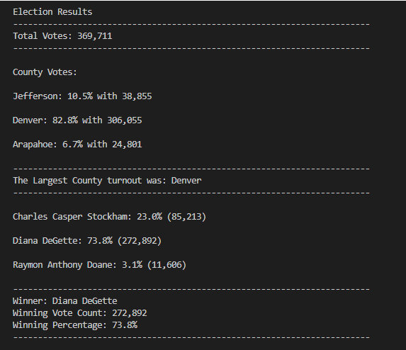

# Election-Analysis

## Project Overview
A Colorado Board of Elections employee has given you the following task to complete the election audit of recent local congressional election.

1. Calculate the total number of votes cast.
2. Get a complete list of candidates who received votes.
3. Calculate the total number of votes each candidate received.
4. Calculate the percentage of votes each candidate won.
5. Determine the winner of the election based on popular vote.

## Resources
-Data Source: election_results.csv
-Software: Python 3.10.4 (64 bit), and IDE Visual Code Version: 1.68.0

## Summary
The analysis of the election show that:
- There were 369,711 votes cast in the election.
- The candidates were:
    - Diana DeGette
    - Raymon Anthony Doane
    - Charles Casper Stockham
- The candidate results were:
    - Diana DeGette received 73.8 of the vote and 272,892 number of votes.
    - Raymon Anthony Doane received 3.1% of the vote and 11,606 number of votes.
    - Charles Casper Stockham received 23.0% of the vote and 85,213 number of votes.
- The winner of the election was:
    - Dianna DeGette, who received 73.8% of the vote and 272,892 number of votes.

- The analysis above breaks down the results for each individual candidate but there was a further request to break-down the
    voting behaviors of each individual county in the State of Colorado.
    - With a total vote contribution of 369,711 by three counties the following is the breakdown of county contribution:
    
        - Arapahoe: 6.7% with 24,801
        - Denver: 82.8% with 306,055
        - Jefferson: 10.5% with 38,855 

#### Election Analysis Terminal Output

 
## Challenge Overview
This challenge demonstrated several python techniques to produce a result. Fors, Ifs, Lists, and Dictionaries, were all
    were all incorporated to produce a result.  I was impressed with the techinque of checking against and empty list to 
    start a 'for' loop for logging information into the counts.

## Challenge Summary
Lastly, this script has the ability to use expanded data sets. It is not limited to a fixed number of candidates or
    counties. As long as the imported data set is sorted by either candidate or county the script will produce
    accurate totals and hence the script is future proof.
    
The challenge here was essential duplicate the same methodoly for the candidate count as the county count but the script 
    could just be expanded for any number of columns of additional data.
